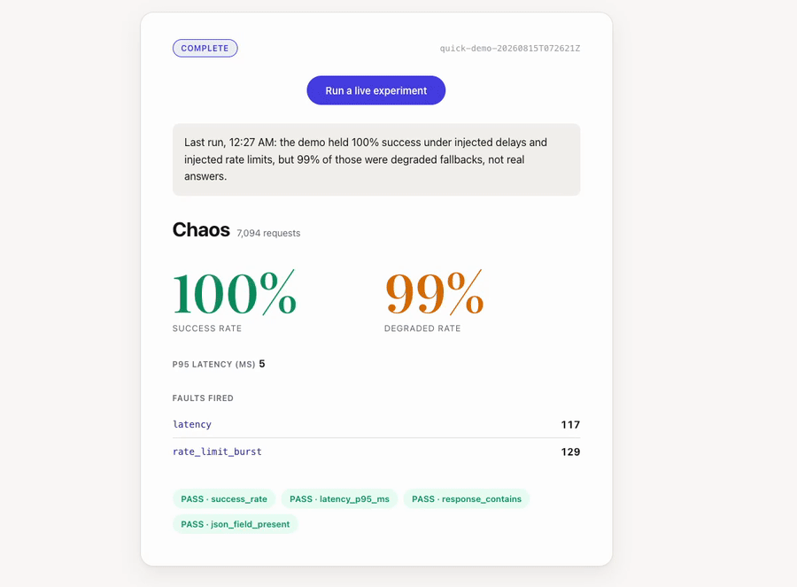

# ChaosLLM

Chaos engineering for LLM applications.



**[Watch it live](https://chaosllm.vercel.app)**, no install required. The dashboard
runs a real experiment against a real demo app on a click, and re-runs one on its own
every hour, so there's always something current on screen.

LLM apps fail in ways ordinary software doesn't: provider rate limits, multi-second
latency spikes, silently truncated or malformed output, context window overflows.
Almost nobody tests for this before it happens in production. ChaosLLM is the fire
drill: point your app's `base_url` at the proxy instead of the real provider, define
which faults to inject in YAML, and get a report that says exactly how your app
degraded and by how much.

## The headline result

Same experiment, same injected faults, run against two builds of the same demo app.

| | naive build | resilient build |
|---|---|---|
| success rate under chaos | **6.9%** | **100%** |
| of those, degraded fallbacks | 0% | **99.9%** |

The naive build has no timeout, no retries, no fallback path, so it fails outright
the moment the LLM call slows down or gets rate-limited. The resilient build never
technically fails, but the 99.9% degraded number matters just as much as the 100%:
almost every "success" is a fallback answer, not a real one, and a report that only
showed the top-line success rate would hide that completely.

## Quickstart

Verified against a clean clone, in a fresh Python 3.12 venv, three steps to a
printed report.

```bash
git clone https://github.com/Rhugved-Kale/ChaosLLM.git && cd ChaosLLM
python3 -m venv .venv && source .venv/bin/activate && pip install -e ".[dev]"
```

```bash
cp .env.example .env   # add your OPENAI_API_KEY or ANTHROPIC_API_KEY
chaosllm demo up       # docker compose: proxy + demo-app + dashboard
```

```bash
chaosllm run experiments/quick-demo.yaml
```

That last command drives load at the demo app, injects latency and rate-limit
bursts partway through, and prints a Markdown report: success rate and p95 latency
per phase, assertion pass/fail, fault-fire counts. Open `http://localhost:5173`
before the run to watch it live. Run it again with `RESILIENT=true` in `.env` and
compare reports; that delta is the whole pitch.

```bash
chaosllm demo down   # tear down when done
```

## Test your own app

The only change your app needs is its provider `base_url`. Both major SDKs support
overriding it directly.

```python
from openai import OpenAI

client = OpenAI(base_url="http://127.0.0.1:8000/openai/v1", api_key="sk-...")
```

```python
from anthropic import Anthropic

client = Anthropic(base_url="http://127.0.0.1:8000/anthropic", api_key="sk-ant-...")
```

Nothing else about your code needs to know chaos testing exists. Every request is
logged to `metrics.jsonl` even with no faults active; define an experiment (below)
to actually inject anything.

## Experiment spec

```yaml
# experiments/vector-db-slow.yaml
name: vector-db-latency-spike
description: RAG behavior when retrieval latency exceeds 200ms
target:
  base_url: http://localhost:8100        # app under test
  endpoint: POST /ask
  payload_file: payloads/questions.jsonl # one JSON body per line, runner cycles them
load:
  concurrency: 8
  duration_s: 120
  warmup_s: 15                           # baseline window, no faults
faults:
  - id: latency
    route: /passthrough/vectordb/*
    delay_ms: 300
    jitter_ms: 100
    p: 1.0
assertions:
  - type: success_rate
    min: 0.95
  - type: latency_p95_ms
    max: 4000
  - type: response_contains          # graceful-degradation marker
    field: answer
    forbid_empty: true
  - type: json_field_present         # RAG answers must still cite sources
    field: citations
    min_items: 1
```

Every run goes through three phases: `warmup` (baseline, faults off), `chaos`
(faults on), `recovery` (faults off again). Every metric is reported per phase; the
baseline-vs-chaos delta is the finding.

## Fault types

| id | what it does | key params |
|---|---|---|
| `latency` | Sleep before forwarding and/or before returning the response | `delay_ms`, `jitter_ms`, `p` |
| `error` | Return a synthetic provider error without calling upstream | `status` (429/500/503), `body`, `p` |
| `timeout` | Accept the request, never respond until the client gives up | `hold_ms` cap, `p` |
| `truncate` | Forward normally, cut the response body at N% of bytes | `keep_fraction`, `p` |
| `malformed_json` | Forward normally, corrupt the JSON (drop closing brace, mangle a key) | `mode`, `p` |
| `context_overflow` | Return the provider-shaped "context length exceeded" error | `p` |
| `model_downgrade` | Rewrite the `model` field in the request to a weaker model | `to_model`, `p` |
| `rate_limit_burst` | Stateful: after N requests in a window, return 429 with retry-after | `limit`, `window_s` |

Every synthetic error mimics the real provider's error shape (status, JSON body,
headers like `retry-after`), pinned from official docs in
[`chaosllm/faults/provider_shapes.py`](chaosllm/faults/provider_shapes.py), so your
SDK's own retry logic reacts to an injected fault the same way it would to the real
thing.

## Architecture

```
                        +---------------------------+
                        |     chaosllm proxy        |
  +----------+  HTTP    |  +---------------------+  |   HTTP   +----------------+
  | Your app | -------> |  | fault middlewares   |--|--------> | LLM provider   |
  | (or demo | <------- |  | latency|errors|...  |  | <------- | (OpenAI/       |
  |  RAG app)|          |  +---------------------+  |          |  Anthropic/...)|
  +----------+          |     |  metrics tap        |          +----------------+
       ^                +-----|---------------------+
       |                      v
       |                +-----------+     +------------------+
  load generated by     | SQLite +  | <-- | experiment runner |  <- experiment.yaml
  the runner            | JSONL log |     | (async load gen)  |
                        +-----------+     +------------------+
                              |
                              v
                     +------------------+        +-----------------+
                     | report generator | -----> | dashboard (SSE) |
                     | (md + json)      |        | React, live     |
                     +------------------+        +-----------------+
```

Three deployables, one repo:

- `chaosllm/`: the Python package. Fault-injection proxy, experiment runner, report
  generator, CLI (`chaosllm proxy | run | report | demo`).
- `demo/`: a small RAG service (FastAPI + chromadb) used as the app under test for
  the live demo. Has a naive and a resilient build behind a flag; see
  [docs/resilience-patterns.md](docs/resilience-patterns.md).
- `dashboard/`: a React app that watches a run live over SSE.

## Development

```bash
ruff check .
ruff format --check .
mypy chaosllm
pytest -q
```

The demo app (`demo/`) and dashboard (`dashboard/`) have their own lint/test
commands; see their CI jobs in `.github/workflows/ci.yml`.

## Limitations (v0.1)

- No streaming fault injection: a `stream: true` request is passed through
  untouched. Faulting a live token stream is a real feature, just not this version's.
- No Kubernetes operator or multi-node load generation. Single-process asyncio load
  generator; enough to demonstrate the resilience delta, not a load-testing tool.
- No hallucination or output-quality scoring. Assertions are deterministic (response
  non-empty, a field present, latency under a threshold), not a judgment on whether
  the answer was actually good.
- No auth or multi-tenancy. This is a developer tool you run yourself, not a hosted
  service with accounts.
- The provider error shapes in `chaosllm/faults/provider_shapes.py` are pinned from
  current OpenAI and Anthropic docs at the time they were written. Providers change
  error formats without much notice; treat these as a snapshot, not a guarantee.
- The hosted demo runs a low-cost model under a hard daily budget cap
  (`BUDGET_DAILY_USD`) and will return 402 once it's spent for the day. That's by
  design, not a bug.
